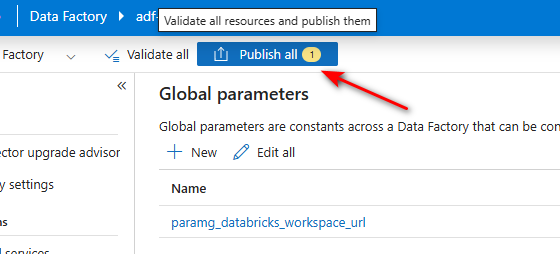
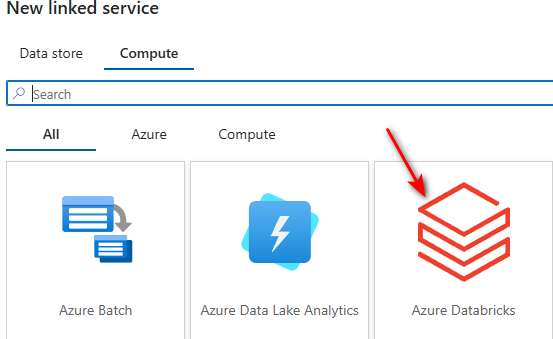
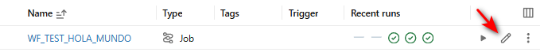
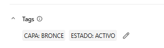

# Laboratorio: ADF + Key Vault + Databricks en Azure Free Account

Guía completa para replicar, desde cero, el flujo de: Data Factory obteniendo un token de Databricks desde Key Vault mediante Identidad Administrada, buscando un Job por nombre, y ejecutándolo dinámicamente.

> **Nota sobre la cuenta Free**: con la suscripción "Free Trial" tienes un límite de 4 cores totales, por lo que **no puedes crear un clúster estándar (Job Cluster) de Databricks** — solo clústeres **Single Node**. La guía usa Single Node en todos los pasos donde se necesita cómputo.

---

## Índice

1. Crear el Resource Group
2. Crear Azure Key Vault
3. Crear el workspace de Azure Databricks
4. Generar un Personal Access Token (PAT) en Databricks
5. Guardar el secreto (token) en Key Vault
6. Crear Azure Data Factory (incluye 6.1 Global Parameter con la URL del workspace)
7. Dar permisos a la Identidad Administrada de ADF sobre Key Vault
8. Crear el Linked Service de Databricks en ADF
9. Crear un Job de prueba en Databricks
10. Pipeline 1: obtener el token desde Key Vault
11. Pipeline 2: buscar el `job_id` por nombre, validado por tags
12. Pipeline orquestador: ejecutar el Job dinámicamente
13. Probar el flujo completo
14. Checklist final

---

## 1. Crear el Resource Group

Portal → **Grupos de recursos** → **Crear**.

| Campo | Valor sugerido |
|---|---|
| Suscripción | Azure subscription 1 (Free Trial) |
| Nombre | `rg-lab-adf-databricks` |
| Región | East US 2 (o la más cercana con cupo — en Free Trial a veces hay regiones con más disponibilidad de cores) |

Alternativa por CLI (si tienes Azure CLI instalado localmente):
```bash
az login
az group create --name rg-lab-adf-databricks --location eastus2
```

---

## 2. Crear Azure Key Vault

Portal → **Crear un recurso** → buscar **Key Vault** → **Crear**.

| Campo | Valor sugerido |
|---|---|
| Resource Group | `rg-lab-adf-databricks` |
| Nombre del key vault | `kv-lab-michael01` (debe ser único a nivel global) |
| Región | misma que el Resource Group |
| Plan de tarifa | Standard |
| Modelo de permisos | **Directiva de acceso de Vault** (Access Policies) — más simple para este laboratorio que RBAC |

Deja el resto por defecto y crea. Espera a que termine el deployment (1-2 min).

> Guarda el nombre exacto del Key Vault, lo necesitarás en las expresiones de ADF.

> **Si al crear un secreto te sale el error "RBAC no permite la operación" / "Error al crear el secreto"**: significa que el Key Vault quedó con el modelo **RBAC** en vez de "Directiva de acceso de Vault" (a veces el portal lo fuerza así por defecto, sin importar lo que elijas). Con RBAC, ni siquiera el dueño de la suscripción tiene permiso automático para crear secretos — hay que asignártelo explícitamente. Dos formas de resolverlo:
> - **Opción rápida (sin cambiar el modelo)**: ve a **Control de acceso (IAM)** → **Agregar** → **Agregar asignación de roles** → rol **Key Vault Secrets Officer** → asignar a tu propio usuario → Guardar. Espera 2-5 minutos (el cambio de rol tarda en propagarse) y reintenta crear el secreto.
> - **Opción alternativa**: ve a **Configuración de acceso** (junto a "Control de acceso (IAM)") → cambia el modelo de permisos a **"Directiva de acceso de Vault"** → luego en **Directivas de acceso** → **Create** → permisos de Secret `Get`, `List`, `Set`, `Delete` → selecciona tu usuario → Guardar.
>
> Ten en cuenta que si tu vault terminó en modelo **RBAC**, el paso 7 (dar permiso a la Managed Identity de ADF) también debe hacerse por RBAC — asigna el rol **Key Vault Secrets User** (de solo lectura) a la Managed Identity del Data Factory, en vez de usar Directivas de acceso.

---

## 3. Crear el workspace de Azure Databricks

Portal → **Crear un recurso** → buscar **Azure Databricks** → **Crear**.

| Campo | Valor sugerido |
|---|---|
| Resource Group | `rg-lab-adf-databricks` |
| Nombre del workspace | `dbw-lab-michael01` |
| Región | misma que los recursos anteriores |
| Plan de tarifa | **Premium** (necesario si más adelante quieres probar Unity Catalog / control de acceso; para lo básico de este lab, Standard también funciona) |
| **Tipo de área de trabajo** | **Híbrido** (también llamada "área de trabajo clásica") |
| Nombre del grupo de recursos administrados | `rg-managed-dbw-lab-michael01` |

> **Sobre el "Nombre del grupo de recursos administrados"**: es un Resource Group aparte que Databricks crea automáticamente para alojar la infraestructura que él mismo gestiona (VNet, Storage Account del workspace/DBFS, Network Security Group, etc.). No lo operas directamente, pero debes darle un nombre único dentro de tu suscripción (distinto de `rg-lab-adf-databricks`). Una vez creado el workspace, este nombre **no se puede cambiar**. No necesitas crearlo tú antes — Azure lo genera solo al terminar el deployment.

> **¿Por qué Híbrido y no Sin servidor?** El tipo **Sin servidor** viene preconfigurado solo con cómputo administrado por Databricks (pensado para Unity Catalog + modo de acceso compartido, Lakebase, Genie, Apps) y no te deja crear ni administrar clústeres clásicos. Este laboratorio necesita un **clúster Single Node clásico**, un **PAT token**, y un **Linked Service de ADF apuntando a ese clúster existente** — ese patrón solo existe en el tipo **Híbrido**. El proceso sin servidor sigue estando disponible dentro de un workspace Híbrido si más adelante lo quieres probar.

> **Nota sobre la suscripción Free Trial**: la documentación oficial de Microsoft indica que, para crear un área de trabajo de Azure Databricks, se requiere una suscripción que **no** sea "Evaluación gratuita" — de tenerla, recomienda cambiarla a pago por uso, quitar el límite de gasto y pedir aumento de cuota de vCPUs. En la práctica, muchos usuarios logran crear workspaces y clústeres Single Node igual con Free Trial, así que probablemente puedas avanzar sin problema. Si al crear el clúster te aparece un error tipo `QuotaExceeded` o no te deja continuar, ese es el motivo — la solución es cambiar la suscripción a "Pago por uso" (sigues gastando tu mismo crédito de $200, no te cobra nada adicional por el cambio en sí).

Crea y espera el deployment (puede tardar 5-10 min).

Al terminar, entra al workspace (botón **Launch Workspace**).

### Crear un clúster Single Node (para poder correr notebooks/jobs)

Dentro del workspace: **Compute** → **Create compute**.

### General

| Campo | Valor |
|---|---|
| Compute name | `cluster-lab-singlenode` |
| Policy | Unrestricted |

### Performance

| Campo | Valor |
|---|---|
| Machine learning | sin marcar |
| Databricks runtime | 17.3 LTS (el que te sugiera por defecto) |
| Photon acceleration | **desmarcado** — no lo necesitas para pruebas simples, consume más DBUs |
| Preferred node type | déjalo en el que Azure te sugiera automáticamente por tu cuota (ej. `Standard_DC4as_v5`, 16 GB / 4 Cores) — **no lo cambies** |
| Single node | **marcado** ✓ |
| Terminate after | `30` o `60` minutos (para no gastar crédito si lo dejas prendido) |

### Tags

Puedes dejarlo vacío, no es obligatorio para este laboratorio.

### Advanced

No necesitas tocarlo para este lab, déjalo colapsado.

> **Nota**: si al abrir el formulario ves un aviso amarillo tipo *"Based on your existing cloud quotas, your default compute size has been reduced"*, es normal — es la cuota de 4 cores de tu cuenta Free Trial. Databricks ya autoajustó **Single Node** y el tipo de nodo por ti; no es un error, solo continúa.

Guarda con **Create compute** y espera que el estado pase de "Pending" a "Running" (puede tardar unos minutos).

---

## 4. Generar un Personal Access Token (PAT) en Databricks

Dentro del workspace: ícono de tu usuario (arriba a la derecha) → **User Settings** → pestaña **Developer** → **Access tokens** → **Manage** → **Generate new token**.

- Comment: `token-adf-lab`
- Lifetime: 90 días (o el que prefieras; en producción normalmente se rota)
- Scope: selecciona **"Other APIs"** (la otra opción, "BI Tools", es solo para herramientas tipo Tableau/Power BI conectadas a SQL Warehouses)
- **API scope(s)**: este campo es obligatorio — el botón **Generate** queda deshabilitado hasta que elijas al menos un scope. Haz clic en el dropdown y selecciona:
  - **`All APIs`** (si aparece como opción) — lo más simple para este laboratorio, cubre todo lo que necesitas.
  - Si no ves esa opción y te aparece una lista granular, selecciona al menos **`Jobs`** (necesario para `jobs/list` y para que el Linked Service de ADF pueda ejecutar el Job) y **`Clusters`** (por si necesita consultar el estado del clúster).
  - En un entorno productivo real conviene acotar el token solo a los scopes estrictamente necesarios (por ejemplo, solo `Jobs`), pero para este lab `All APIs` simplifica las cosas.

**Copia el token inmediatamente** — solo se muestra una vez.

También anota la **URL del workspace**, que aparece en la barra de direcciones del navegador, algo como:
```
https://adb-1234567890123456.7.azuredatabricks.net
```
(sin el `/` final ni rutas adicionales).

---

## 5. Guardar el secreto en Key Vault

Portal → tu Key Vault (`kv-lab-michael01`) → **Objetos** → **Secretos** → **Generar/Importar**.

**Secreto — el token:**

| Campo | Valor |
|---|---|
| Nombre | `databricks-pat` |
| Valor | el PAT que copiaste en el paso 4 |

> La URL del workspace **no** se guarda en Key Vault en esta guía — se define como **Global Parameter dentro de Azure Data Factory** (ver paso 6.1). Así evitas una llamada extra a Key Vault solo para un dato que no es sensible y que casi nunca cambia.

---

## 6. Crear Azure Data Factory

Portal → **Crear un recurso** → buscar **Data Factory** → **Crear**.

| Campo | Valor sugerido |
|---|---|
| Resource Group | `rg-lab-adf-databricks` |
| Nombre | `adf-lab-michael01` |
| Región | misma que los demás recursos |
| Versión | V2 |
| Git configuration | puedes omitirla para el laboratorio ("Configure Git later") |

Crea y espera el deployment. Al terminar, entra con **Ir al recurso** → **Iniciar Studio** (o **Launch Studio**).

### 6.1 Crear el Global Parameter con la URL del workspace

En ADF Studio: **Manage** (ícono de caja de herramientas) → **Global parameters** → **+ New**.

| Campo | Valor |
|---|---|
| Nombre | `paramg_databricks_workspace_url` |
| Tipo | String |
| Valor predeterminado | `https://adb-1234567890123456.7.azuredatabricks.net` (la URL que anotaste en el paso 4, sin `/` final) |

Guarda. Este parámetro queda disponible en **todos** los pipelines del Data Factory mediante `pipeline().globalParameters.paramg_databricks_workspace_url` — no hace falta declararlo en cada pipeline ni pasarlo por Execute Pipeline.

> **No olvides publicar**: crear el Global Parameter no lo guarda de forma permanente por sí solo — verás el botón **Publish all** arriba con un contador (ej. "1"). Haz clic en **Publish all** y confirma, o el parámetro se perderá si cierras la sesión sin publicar.



> Si el día de mañana cambias de workspace de Databricks (por ejemplo pasas de dev a prod), solo actualizas este único valor y todos los pipelines quedan apuntando al nuevo workspace, sin tocar código.

---

## 7. Dar permisos a la Identidad Administrada de ADF sobre Key Vault

Cuando creas un Data Factory, automáticamente se crea una **Managed Identity (System Assigned)** con el mismo nombre del ADF. Esa identidad es la que usará el Web Activity para autenticarse contra Key Vault — **no necesitas crear ni configurar ninguna credencial adicional**, solo darle permiso.

1. Ve a tu **Key Vault** → **Control de acceso (IAM)** *o* **Directivas de acceso** (según el modelo de permisos que elegiste en el paso 2).

### Si elegiste "Directiva de acceso de Vault" (recomendado para este lab):
- **Access Policies** → **Create**.
- Permisos de **Secret**: marca `Get` y `List`.
- **Selecionar entidad de seguridad**: busca el nombre exacto de tu Data Factory (`adf-lab-michael01`) — aparecerá en la lista porque su Managed Identity ya existe.
- Guarda.

### Si elegiste modelo RBAC:
- **Control de acceso (IAM)** → **Agregar asignación de roles**.
- Rol: **Key Vault Secrets User**.
- Asignar acceso a: **Managed identity** → **Data Factory** → selecciona `adf-lab-michael01`.
- Guarda.

> Sin este paso, las llamadas Web desde ADF a Key Vault fallarán con 403 Forbidden.

---

## 8. Crear el Linked Service de Databricks en ADF

Aunque en este laboratorio la conexión a Key Vault la hacemos con llamadas Web "manuales" (para tener control total del token), sigues necesitando un **Linked Service de tipo Azure Databricks** para poder usar la actividad nativa **"Trabajo" (Job)** más adelante.

En ADF Studio: **Manage** (ícono de caja de herramientas) → **Linked services** → **+ New** → busca **Azure Databricks**.

> Al abrir el panel "New linked service" verás dos pestañas: **Data store** y **Compute**. Azure Databricks aparece únicamente en la pestaña **Compute** (junto a Azure Batch y Azure Data Lake Analytics) — selecciona esa tarjeta con el ícono rojo de capas apiladas.



| Campo | Valor |
|---|---|
| Nombre | `ls_lab_databricks` |
| Cuenta de Databricks a usar | **From Azure subscription** |
| Selecciona la suscripción y el workspace | `dbw-lab-michael01` |
| Seleccionar clúster | **Existing interactive cluster** — evita el problema de cores del Free Trial |
| Método de autenticación | **Access token** |
| Access token | click en la pestaña **Azure Key Vault** (en vez de pegar el token directo) |

### Configurar el origen del token vía Key Vault (sub-pasos)

Al hacer clic en la pestaña **Azure Key Vault**, verás los campos "AKV linked service", "Secret name" y "Secret version" — y **no habrá ningún Linked Service de Key Vault todavía**, eso es esperado, lo creas ahí mismo:

1. En el dropdown **"AKV linked service"** → **+ New**.
2. En el mini-formulario que se abre:
   - **Name**: `ls_lab_keyvault`
   - **Azure subscription**: la tuya
   - **Azure Key Vault name**: `kv-lab-michael01`
3. Click **Test connection** (debe salir verde ✓) → **Create**.
4. De vuelta en el formulario de Databricks, ya debería quedar seleccionado `ls_lab_keyvault`.
5. **Secret name**: selecciona `databricks-pat` del dropdown.
6. **Secret version**: deja "Latest version".
7. En el campo **"Existing Cluster ID"** (que hasta ahora decía *"Add workspace and access token to list options"*), haz clic en el ícono de **refrescar (🔄)** — debería listarte tu clúster Single Node; selecciónalo.

> Si el clúster no aparece después de refrescar, casi siempre es porque la **Managed Identity del Data Factory** aún no tiene permiso de lectura sobre el Key Vault (mismo tema del paso 7). Verifica que tenga `Get`/`List` en Directivas de acceso, o el rol `Key Vault Secrets User` si tu vault quedó en modelo RBAC.

Da **Test connection** y confirma que funciona.

---

## 9. Crear un Job de prueba en Databricks

Para poder probar la búsqueda por nombre, necesitas: **(A)** un notebook simple, y **(B)** un Job que lo ejecute. Vamos en ese orden porque el Job te pide seleccionar un notebook que ya exista.

### A. Crear el notebook

1. En el menú lateral izquierdo de Databricks: **Workspace**.
2. Verás una carpeta con tu usuario (tu correo, ej. `email_suscripcion@outlook.com`) — haz clic en ella para entrar.
3. Arriba a la derecha, botón **Create** → **Notebook**.
4. En el formulario:
   - **Name**: `nb_test_carga_bronce`
   - **Default language**: Python
   - **Cluster**: selecciona tu clúster `cluster-lab-singlenode` (si aparece apagado, no importa, Databricks lo prende solo al ejecutar la primera celda)
5. Se abre el notebook. En la primera celda escribe:
   ```python
   print("hola mundo")
   ```
6. Ejecuta la celda (▶ o `Shift + Enter`). Espera a que el clúster arranque (puede tardar 3-5 min si estaba apagado) y confirma que imprime el mensaje.
7. El notebook se guarda solo — no necesitas hacer nada más. Anota la ruta donde quedó, algo como:
   ```
   /Workspace/Users/email_suscripcion@outlook.com/nb_test_carga_bronce
   ```

### B. Crear el Job y su Task

1. Menú lateral: **Jobs & Pipelines** → **Create new** → **Job** (o vía el botón "+ New" → "Job").
2. Arriba a la izquierda, donde dice el nombre por defecto del Job (algo como "New Job [fecha]"), haz clic y renómbralo a: `WF_TEST_HOLA_MUNDO`.
3. Se abre automáticamente el editor de la primera tarea ("Unnamed task"), con el panel de configuración abajo. Completa:

| Campo | Valor |
|---|---|
| **Task name** | `task_carga_bronce` (obligatorio — es el identificador de esta tarea dentro del Job, no el nombre del Job) |
| **Type** | Notebook (ya viene seleccionado) |
| **Source** | Workspace (ya viene seleccionado — significa que el notebook vive dentro del workspace de Databricks, no en un repo Git externo) |
| **Path** | haz clic en el campo (dice "Select Notebook") → se abre un explorador de carpetas → navega a **Workspace → Users → tu correo** → selecciona `nb_test_carga_bronce` → clic en **Select** |
| **Compute** | déjalo en `cluster-lab-singlenode` (ya viene seleccionado porque lo elegiste al crear el notebook) |
| **Dependent libraries** | déjalo vacío, no lo necesitas para este test |
| **Parameters** | déjalo vacío |
| **Notifications** | déjalo vacío |

4. Arriba a la derecha del lienzo (donde están los íconos ▶ 📋 🚫 🗑️), puedes darle **▶ Run now** para probar que el Job corre bien manualmente antes de conectarlo con ADF.
5. El Job se guarda automáticamente a medida que completas los campos — no hay un botón explícito de "Guardar", pero puedes confirmar que quedó bien volviendo a **Jobs & Pipelines** y viendo `WF_TEST_HOLA_MUNDO` en la lista.

> Si más adelante quieres reutilizar este mismo Job con otro nombre para tus pruebas de búsqueda por `name`, simplemente crea otro Job repitiendo el punto B con un nombre distinto — no hace falta un notebook distinto, puedes reutilizar el mismo `nb_test_carga_bronce`.

### C. Agregar los Tags `CAPA` y `ESTADO` (para validar que sea el Job correcto)

Databricks permite tener dos Jobs con el mismo nombre (por ejemplo si se clona uno sin cambiarle el nombre). Para que el pipeline elija el correcto aunque exista un duplicado, cada Job necesita 2 **Tags a nivel de Job**, que luego una actividad **Filter** en el Pipeline 2 (paso 11) usa para descartar cualquier candidato que no coincida:

1. Dentro del Job (no dentro de una tarea — asegúrate de estar en la vista general del Job), busca el panel de detalles a la derecha, o el ícono de lápiz ✏️ junto al nombre del Job / sección **"Job details"**. También se puede acceder directo desde el listado de **Jobs & Pipelines**, haciendo clic en el ícono de lápiz ✏️ de la fila correspondiente:



2. Busca la sección **Tags** → **+ Add**.
3. Agrega dos filas (**Key y Value siempre en mayúscula**):

| Key | Value |
|---|---|
| `CAPA` | `BRONCE` (para este Job de ejemplo; en otros Jobs del proyecto se usará `LANDING` o `RAW` según corresponda) |
| `ESTADO` | `ACTIVO` |

4. Guarda.



> **Valores posibles de `CAPA`**: `LANDING`, `RAW`, `BRONCE` (según en qué etapa del pipeline de datos participe ese Job). Para `WF_TEST_HOLA_MUNDO` se usa `BRONCE`.
> **Valor de `ESTADO`**: siempre `ACTIVO` para el Job que realmente debe ejecutarse. Para probar qué pasa cuando la validación falla, se puede dejar un Job duplicado con el mismo nombre pero con `ESTADO = INACTIVO` (o sin el tag) — la validación del Pipeline 2 (paso 11) debe rechazarlo aunque la API devuelva ese Job en vez del correcto.

Estos 2 tags son los que el Pipeline 2 revisa antes de confiar en el `job_id` que devuelva la API.

---

## 10. Pipeline 1 — obtener el token desde Key Vault

En ADF Studio: **Author** → **Pipelines** → **New pipeline**. Nómbralo `pl_get_databricks_token`.

**Parámetros del pipeline** (pestaña Parameters):
| Nombre | Tipo |
|---|---|
| `PRM_KEYVAULT_NAME` | String (valor por defecto: `kv-lab-michael01`) |

**Actividad única — Web `GetAdbToken`:**

| Campo | Valor |
|---|---|
| URL | `@concat('https://', pipeline().parameters.PRM_KEYVAULT_NAME, '.vault.azure.net/secrets/databricks-pat?api-version=7.0')` |
| Método | GET |
| Autenticación | **System Assigned Managed Identity** |
| Recurso | `https://vault.azure.net` |

> Ya no hay una segunda actividad Web para la URL del workspace — esa URL ahora viene del **Global Parameter** `paramg_databricks_workspace_url` que creaste en el paso 6.1, y se lee directamente en el Pipeline 2 sin pasar por Key Vault ni por este pipeline.

### Agregar la actividad "Set variable" para devolver el token

1. En el panel izquierdo **Activities**, busca `set` en el buscador (o abre la categoría **General**) y arrastra al lienzo la actividad **Set variable**.
2. Suéltala a la derecha de `GetAdbToken` y conéctalas: pasa el mouse sobre el borde derecho de `GetAdbToken` hasta que aparezca la flecha verde (✓ éxito), haz clic y arrastra hasta la actividad "Set variable" que acabas de agregar.
3. Haz clic sobre la actividad "Set variable" para seleccionarla. En la parte superior, dale doble clic al nombre por defecto (algo como "Set variable1") y renómbrala a: `AdbToken`.
4. Con la actividad seleccionada, ve a la pestaña **Settings** (en el panel inferior).
5. En **"Variable type"**, marca el radio button **"Pipeline return value"** (no "Pipeline variable" — esa opción es para variables internas del pipeline, no para devolver el valor a quien lo invoque).
6. Haz clic en **"+ New"** para agregar una fila en la tabla de "Values", y completa:

| Campo | Valor |
|---|---|
| Name | `AdbToken` |
| Type | Expression |
| Value | `@activity('GetAdbToken').output.value` |

**Publica el pipeline** (botón **Publish all**, arriba a la izquierda).


---

## 11. Pipeline 2 — buscar el `job_id` por nombre, validado por tags

Nuevo pipeline: `pl_get_job_id`. Este pipeline tiene 4 actividades: obtener el token (Execute Pipeline), traer todos los Jobs que coincidan por nombre (Web), quedarse solo con el que tenga los tags correctos (Filter), y devolver su `job_id` (Set Variable).

**Parámetros:**
| Nombre | Tipo |
|---|---|
| `PRM_ADB_JOB_NAME` | String |
| `PRM_CAPA` | String (ej. `BRONCE`) |
| `PRM_KEYVAULT_NAME` | String (default `kv-lab-michael01`) |

### Actividad 1 — Execute Pipeline

1. En el panel izquierdo **Activities**, busca `execute` (o abre la categoría **General**) y arrastra al lienzo la actividad **Execute Pipeline**.
2. Selecciónala y, en la pestaña **General** (panel inferior), renómbrala a: `Exec_pl_get_databricks_token` (reemplaza el nombre por defecto que trae, algo como "Execute Pipeline1").
3. Ve a la pestaña **Settings** y completa:

| Campo | Valor |
|---|---|
| Canalización invocada | `pl_get_databricks_token` |
| Esperar a la finalización | activado (checkbox marcado) |

4. Debajo, en la tabla **Parameters**, agrega una fila:

| Nombre | Tipo | Valor |
|---|---|---|
| `PRM_KEYVAULT_NAME` | Expression | `@pipeline().parameters.PRM_KEYVAULT_NAME` |

### Actividad 2 — Web `GetJobIdADB`

Arrastra una actividad **Web** (categoría **General**) al lienzo, a la derecha de "Exec_pl_get_databricks_token", y conéctala con la flecha verde de éxito. Renómbrala a `GetJobIdADB` (doble clic en el nombre arriba de la actividad). Selecciónala y ve a la pestaña **Settings**, y completa cada campo así:

1. **URL**: haz clic dentro del campo y escribe/pega directamente la expresión (no hace falta abrir el editor de expresiones, ADF la reconoce por el `@` inicial):
   ```
   @concat(pipeline().globalParameters.paramg_databricks_workspace_url, '/api/2.2/jobs/list?name=', encodeUriComponent(pipeline().parameters.PRM_ADB_JOB_NAME), '&limit=25')
   ```
   > A diferencia de una versión anterior de este diseño, aquí **no se usa `limit=1`**. El filtro por `name` ya reduce los resultados a los Jobs que comparten ese nombre exacto, pero si existe más de uno (por ejemplo un duplicado), `limit=25` asegura que la API los traiga **todos** para que la siguiente actividad (Filter) pueda elegir el correcto en vez de quedarse solo con el primero que la API decida devolver.
   > El aviso amarillo *"Information will be sent to the URL specified..."* es solo una advertencia de seguridad estándar de ADF para actividades Web — no es un error, ignóralo.

2. **Method**: haz clic en el dropdown (dice "Select API method...") y selecciona **GET**.

3. **Authentication**: déjalo en **None**.

4. **Headers**: haz clic en el botón **"+ New"** — se agrega una fila con dos campos vacíos:
   - En **Name**, escribe: `Authorization`
   - En **Value**, haz clic dentro del campo y escribe/pega directamente:
     ```
     @concat('Bearer ', activity('Exec_pl_get_databricks_token').output.pipelineReturnValue.AdbToken)
     ```
     (Si prefieres el editor visual en vez de escribir directo, haz clic dentro del campo Value y busca el ícono azul de rayo ⚡ "Add dynamic content" a la derecha del campo — se abre el mismo Generador de expresiones que ya usaste antes.)

> Nota que la URL ya no depende de ningún pipeline hijo — se arma directo con el Global Parameter `paramg_databricks_workspace_url`, disponible en cualquier pipeline del Data Factory sin necesidad de pasarlo como parámetro.

### Actividad 3 — Filter para elegir el Job correcto por `CAPA` y `ESTADO`

En vez de confiar en cuál Job devuelve primero la API, esta actividad revisa **todos** los Jobs que trajo `GetJobIdADB` y se queda solo con el que tenga `CAPA` igual al parámetro `PRM_CAPA` y `ESTADO` igual a `ACTIVO`. La condición está armada con `if()` anidados (en vez de `and()` directo) para que no falle cuando algún Job del listado no tenga tags configurados.

1. En el panel izquierdo **Activities**, busca `filter` (o abre la categoría **Iteración y condicionales**) y arrastra al lienzo la actividad **Filter**.
2. Suéltala a la derecha de `GetJobIdADB` y conéctala con la flecha verde de éxito.
3. Renómbrala a `FiltrarJobCorrecto` (doble clic en el nombre arriba de la actividad).
4. Selecciónala y ve a la pestaña **Settings**. Completa:

**Items:**
```
@activity('GetJobIdADB').output.jobs
```

**Condition:**
```
@if(
    contains(item().settings, 'tags'),
    if(
        and(
            contains(item().settings.tags, 'CAPA'),
            contains(item().settings.tags, 'ESTADO')
        ),
        and(
            equals(item().settings.tags.CAPA, pipeline().parameters.PRM_CAPA),
            equals(item().settings.tags.ESTADO, 'ACTIVO')
        ),
        false
    ),
    false
)
```

Cómo funciona, de afuera hacia adentro:
- **Primer `if`**: por cada Job del array, revisa si tiene la propiedad `tags` siquiera presente. Si no la tiene, ese Job queda descartado (`false`) sin hacer fallar la actividad.
- **Segundo `if`**: si `tags` existe, revisa que ambas claves `CAPA` y `ESTADO` estén presentes. Si falta alguna, ese Job también queda descartado.
- **`and()` final**: solo se evalúa cuando ya se confirmó que ambas claves existen, así que es seguro comparar sus valores contra `PRM_CAPA` y contra `'ACTIVO'`.

> Se usan `if()` anidados y no `and()`/`or()` directamente sobre propiedades que podrían no existir, porque `and()`/`or()` evalúan siempre ambos lados antes de decidir el resultado — si un lado no existe, igual falla, aunque el otro lado ya hubiera bastado para descartar el Job. `if()`, en cambio, solo evalúa la rama que realmente necesita.

### Actividad 4 — Set Variable con el `jobId`

1. Arrastra una actividad **Set variable** (categoría **General**) al lienzo, a la derecha de `FiltrarJobCorrecto`, y conéctala con su flecha verde de éxito.
2. Renómbrala a `jobId` (doble clic en el nombre arriba de la actividad).
3. Selecciónala y ve a la pestaña **Settings**.
4. Marca el radio button **"Pipeline return value"**.
5. Haz clic en **"+ New"** y agrega:

| Name | Type | Value |
|---|---|---|
| `jobId` | Expression | ver expresión abajo |

Expresión para el campo **Value** (cópiala completa):
```
@if(
    equals(length(activity('FiltrarJobCorrecto').output.value), 1),
    string(activity('FiltrarJobCorrecto').output.value[0].job_id),
    if(
        equals(length(activity('FiltrarJobCorrecto').output.value), 0),
        'ERROR_JOB_NO_ENCONTRADO_CON_TAGS_CORRECTOS',
        'ERROR_MULTIPLES_JOBS_CON_TAGS_COINCIDENTES'
    )
)
```

Cómo funciona:
- Si el `Filter` dejó **exactamente 1** Job (el escenario esperado), devuelve su `job_id` real.
- Si dejó **0** Jobs (ninguno tenía los tags correctos), devuelve `'ERROR_JOB_NO_ENCONTRADO_CON_TAGS_CORRECTOS'`.
- Si dejó **más de 1** (caso raro: dos Jobs activos con el mismo nombre y los mismos tags), devuelve `'ERROR_MULTIPLES_JOBS_CON_TAGS_COINCIDENTES'` — esto señala un problema de gobierno de datos que debe corregirse manualmente, en vez de ejecutar cualquiera de los dos a ciegas.

En cualquiera de los dos casos de error, el pipeline orquestador recibe un texto identificable en vez de un `job_id` numérico, y nunca ejecuta un Job sin haber confirmado que es el correcto.

**Publica el pipeline** (botón **Publish all**).

---

## 12. Pipeline orquestador — ejecutar el Job dinámicamente

Nuevo pipeline: `pl_orquestador_test`.

**Actividad 1 — Execute Pipeline `pl_get_job_id`:**
- Parámetros:
  - `PRM_ADB_JOB_NAME` = `WF_TEST_HOLA_MUNDO` (o el nombre real de tu Job de prueba)
  - `PRM_CAPA` = `BRONCE` (debe coincidir exactamente con el tag `capa` que le pusiste al Job en el paso 9.C)

**Actividad 2 — Actividad nativa "Databricks: Ejecutar Job" (Job Activity):**

Arrástrala desde la categoría **Databricks** del panel de actividades.

- Pestaña **Azure Databricks**: Linked Service = `ls_lab_databricks` (el que creaste en el paso 8).
- Pestaña **Configuración**:
  - **Trabajo**: `@activity('Execute Pipeline2').output.pipelineReturnValue.jobId`
  - (Ajusta `'Execute Pipeline2'` al nombre real de tu actividad Execute Pipeline)

**Publica y prueba** con **Debug**.

---

## 13. Probar el flujo completo

1. En `pl_orquestador_test`, click **Debug**.
2. Revisa la salida de cada actividad en la pestaña **Output** de la ejecución:
   - Confirma que `GetAdbToken` devuelve `200` con el secreto correcto.
   - Confirma que el Global Parameter `paramg_databricks_workspace_url` tiene la URL correcta (Manage → Global parameters).
   - Confirma que `GetJobIdADB` devuelve un array `jobs` con todos los Jobs que comparten ese nombre (1 o más si hay duplicados).
   - Confirma que `FiltrarJobCorrecto` dejó exactamente 1 elemento en su `output.value` — ábrelo en el panel de salida y revisa el tamaño del array.
   - Confirma que la actividad `jobId` devolvió el `job_id` real (un número) y no un texto de error. Si te devuelve un error, revisa la tabla de abajo según el mensaje exacto.
   - Confirma que la actividad "Ejecutar Job" dispara la ejecución en Databricks (puedes verificarlo en **Jobs & Pipelines → Runs** dentro de Databricks).

### Errores comunes y su causa

| Error | Causa probable |
|---|---|
| `RBAC no permite la operación` al crear un secreto en Key Vault | El vault quedó en modelo RBAC; asígnate el rol **Key Vault Secrets Officer** sobre el vault (ver nota en el paso 2) y espera unos minutos |
| `403 Forbidden` en Web a Key Vault | Falta el permiso del paso 7, o el nombre del Key Vault en la URL está mal escrito |
| `401 Unauthorized` en `GetJobIdADB` | El token no se está pasando bien en el header `Authorization`, revisa que diga `Bearer ` con espacio |
| `jobs` vacío en `GetJobIdADB` | El nombre en `PRM_ADB_JOB_NAME` no coincide exactamente (recuerda: coincidencia exacta, no contiene), o el Global Parameter `paramg_databricks_workspace_url` tiene una URL incorrecta/con `/` final de más |
| `jobId` devuelve `ERROR_JOB_NO_ENCONTRADO_CON_TAGS_CORRECTOS` | Ningún Job con ese nombre tiene los tags `CAPA`/`ESTADO` esperados. Revisa que el Job correcto tenga `ESTADO = ACTIVO` y `CAPA` igual al valor de `PRM_CAPA` (mismas mayúsculas). |
| `jobId` devuelve `ERROR_MULTIPLES_JOBS_CON_TAGS_COINCIDENTES` | Hay más de un Job con el mismo nombre y los mismos tags `CAPA`/`ESTADO = ACTIVO` — es un problema de gobierno de datos que debe corregirse manualmente en Databricks (dejar un solo Job activo con esa combinación). |
| El clúster no arranca / error de cores | Recuerda usar Single Node en todos lados; un Job Cluster estándar no arrancará en Free Trial |

---

## 14. Checklist final

- [ ] Resource Group creado
- [ ] Key Vault creado, con el secreto `databricks-pat`
- [ ] Databricks workspace creado, con 1 clúster Single Node activo
- [ ] PAT generado y guardado en Key Vault
- [ ] Data Factory creado
- [ ] Global Parameter `paramg_databricks_workspace_url` creado en ADF con la URL del workspace
- [ ] Managed Identity de ADF con permisos `Get`/`List` sobre secretos del Key Vault
- [ ] Linked Service de Databricks creado y probado (Test connection OK)
- [ ] Job de prueba creado en Databricks, con tags `CAPA` y `ESTADO = ACTIVO`
- [ ] Pipeline `pl_get_databricks_token` funcionando
- [ ] Pipeline `pl_get_job_id` funcionando (devuelve `job_id` correcto por nombre, validando tags `CAPA`/`ESTADO`)
- [ ] Pipeline orquestador ejecuta el Job dinámicamente sin errores
